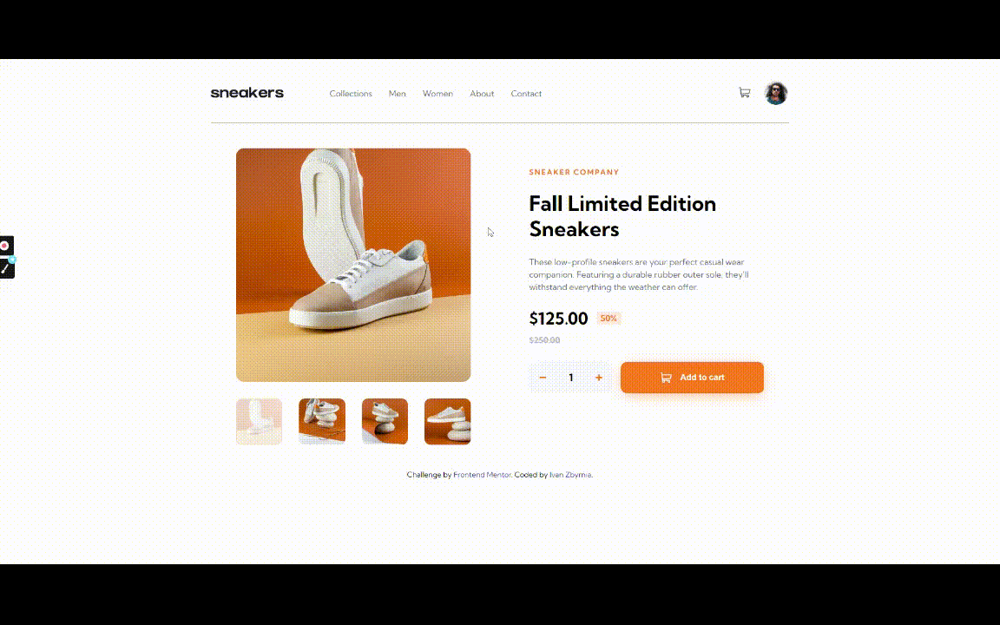

# E-commerce Product Page

## Links

- [Live demo](https://bazinygero.github.io/ecommerce-product-page-main/)

## About
This is a solution to the E-commerce product page challenge from [Frontend Mentor](https://www.frontendmentor.io/challenges/ecommerce-product-page-UPsZ9MJp6).

Users should be able to:
- See hover states for all interactive elements on the page
- Open a lightbox gallery by clicking on the large product image
- Switch the large product image by clicking on the small thumbnail images
- Add items to the cart
- View the cart and remove items from it

## Built with:
- Semantic HTML5 markup
- CSS custom properties
- CSS Flexbox/Grid
- SASS
- Javascript
- Compiled with Gulp
